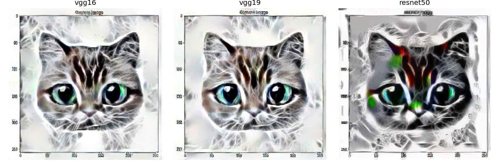

# Neural Style Transfer: VGG16 vs VGG19 vs ResNet50

Neural style transfer by image optimization (Gatys, Ecker, Bethge,
*A Neural Algorithm of Artistic Style*, 2016), with a comparison of three
pretrained backbones as feature extractors: **VGG16**, **VGG19** and
**ResNet50**.

<p align="center">
  
</p>

## How it works

The output image is a trainable tensor, initialized from the content image and
updated by gradient descent so that it is simultaneously:

- **close in content** to the content image — small distance between the deep
  CNN activations (content loss);
- **close in style** to the style image — small distance between the Gram
  matrices of the activations across several layers (style loss);
- **smooth** — a total-variation regularizer (TV loss).

The total loss is

$$\mathcal{L} = \alpha\,\mathcal{L}_{\text{content}} + \beta\,\mathcal{L}_{\text{style}} + \gamma\,\mathcal{L}_{\text{TV}}$$

with

$$\mathcal{L}_{\text{content}} = \tfrac{1}{2}\sum_{i,j}\left(F^{l}_{ij} - P^{l}_{ij}\right)^2, \qquad G^{l}_{ij} = \sum_{k} F^{l}_{ik}\,F^{l}_{jk}, \qquad \mathcal{L}_{\text{style}} = \sum_{l} w_l\,\lVert G^{l} - A^{l}\rVert_2^2 .$$

Here $F^l$ are the activations of the generated image at layer $l$, $P^l$ those
of the content image, and $A^l$, $G^l$ the Gram matrices of the style and
generated images.

## Install

```bash
poetry install
```

Python 3.10–3.12. The device is selected automatically (CUDA, then Apple MPS,
then CPU).

## Usage

Stylize a single content/style pair:

```bash
poetry run style-transfer \
    --content assets/content1.jpg \
    --style   assets/style1.jpg \
    --output  result.jpg \
    --backbone vgg19 --steps 50
```

Run several pairs at once (paired by position, written to `--out-dir`):

```bash
poetry run style-transfer \
    --content assets/content1.jpg assets/content2.jpeg \
    --style   assets/style1.jpg  assets/style2.jpeg \
    --out-dir out/
```

Apply one style to many content images (the single list is broadcast):

```bash
poetry run style-transfer \
    --content assets/content1.jpg assets/content2.jpeg assets/content3.jpg \
    --style   assets/style1.jpg \
    --out-dir out/
```

Key options: `--backbone {vgg16,vgg19,resnet50}`, `--image-size`, `--steps`,
`--optimizer {lbfgs,adam}`, `--lr`, `--style-weight`, `--content-weight`,
`--tv-weight`, `--device`.

From Python:

```python
from style_transfer import build_extractor, load_image, save_image
from style_transfer.transfer import TransferConfig, run_style_transfer

content = load_image("assets/content1.jpg")
style = load_image("assets/style1.jpg")
extractor = build_extractor("vgg19")

cfg = TransferConfig(
    content_layers=["conv4_2"],
    style_layers=["conv1_1", "conv2_1", "conv3_1", "conv4_1", "conv5_1"],
    style_weight=1e6, steps=50,
)
result = run_style_transfer(content, style, extractor, cfg)
save_image(result.image, "result.jpg")
```

## Results

| Backbone | Style layers | Texture quality | Artifacts |
|----------|-------------|-----------------|-----------|
| VGG16    | 13 conv     | good            | few       |
| VGG19    | 16 conv     | best            | few       |
| ResNet50 | 16 blocks   | medium          | noticeable |

ResNet50 produces noticeably noisier results: its bottleneck activations (with
residual connections and batch normalization) describe style texture less
faithfully than the sequential convolutional features of VGG — which is why VGG
networks dominate the NST literature. See the full write-up in
[docs/report.pdf](docs/report.pdf).

## License

MIT — see [LICENSE](LICENSE).
