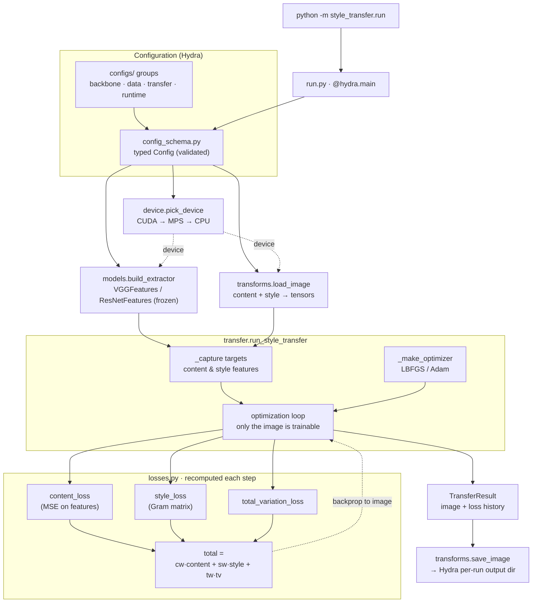

# Architecture

How a style-transfer run flows through the package, from the Hydra entry point
to the written image. Each node names the module that owns it; GitHub renders
the diagram below natively (no build step). Keep it in sync by hand when the
pipeline changes — it is a map, not a generated artifact.

## Reading the diagram

- **Entry & config** — [run.py](../src/style_transfer/run.py) is the Hydra entry
  point; `configs/` groups are composed and validated against the typed schema
  in [config_schema.py](../src/style_transfer/config_schema.py).
- **Setup** — the device is resolved once
  ([device.py](../src/style_transfer/device.py)), the frozen backbone is built
  ([models.py](../src/style_transfer/models.py)), and the content/style pair is
  loaded ([transforms.py](../src/style_transfer/transforms.py)).
- **Optimization** — [transfer.py](../src/style_transfer/transfer.py) captures
  the content/style targets once, then iterates: the generated image is the only
  trainable tensor, and each step recomputes the three losses
  ([losses.py](../src/style_transfer/losses.py)) and backpropagates into it.
- **Output** — the final image is written into Hydra's per-run output directory,
  so repeated runs and `--multirun` sweeps never collide.
